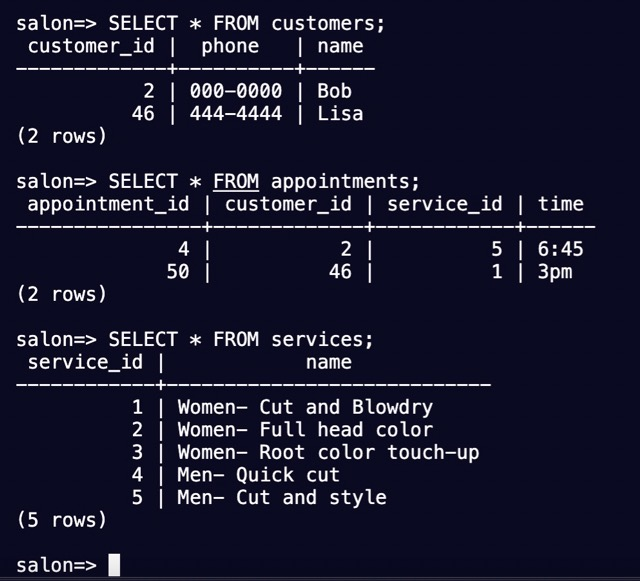

# Build a Salon Appointment Scheduler Challenge

This project creates an interactive Bash program that uses PostgreSQL to track customers and appointments for a salon.

## Program Output

## PostgreSQL Databases

